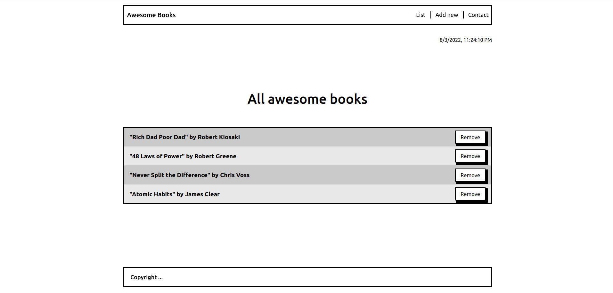
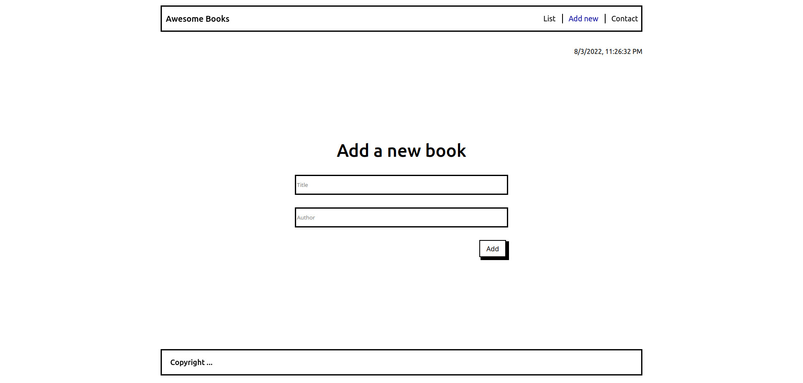

# Project Name

> Awesome Books

# Description

> A simple website containing a list of books that can be modified through adding or removing a book


## Built With

- HTML
- JavaScript
- CSS

## Screenshots




## Live demo

https://peter1907.github.io/Awesome-Books-ES6/

## Getting Started

To get a local copy up and running follow these simple example steps.

### Prerequisites
 - IDE(code editor) like: **Vscode**, **Sublime**, etc.  
 - [Git](https://www.linode.com/docs/guides/how-to-install-git-on-linux-mac-and-windows/)

### Setup
  1. Download the **Zip** file or clone the repo with: ```bash git clone [https://github.com/Tadessejemal1/Awesome-books.git-  https://github.com/Tadessejemal1/Awesome-books.git/)
  2.  ``` To access cloned directory run: ```bash cd/Single-page-website ``` 
  3. Open it with the live server

### Usage
  - First you would find the list of books in the "List" section empty.
  - To add a book to the list .. navigate to the "Add new" section & add the "title"   and the "author", then click Add.
  - To remove a book from the list click teh remove button displayed next to the book in the "List" section.

## Authors

## 👤 Peter Beshara.

- GitHub: [@Peter1907](https://github.com/Peter1907)
- Twitter: [@Peter_Beshara_](https://twitter.com/Peter_Beshara_)
- LinkedIn: [LinkedIn](https://www.linkedin.com/in/peter-beshara-b33681241/)

## 🤝 Contributing

Contributions, issues, and feature requests are welcome!

Feel free to check the [issues page](../../issues/).

## Show your support

Give a ⭐️ if you like this project!

## Acknowledgments

- Hat tip to anyone whose code was used
- Inspiration
- etc

## 📝 License

This project is [MIT](./MIT.md) licensed.
